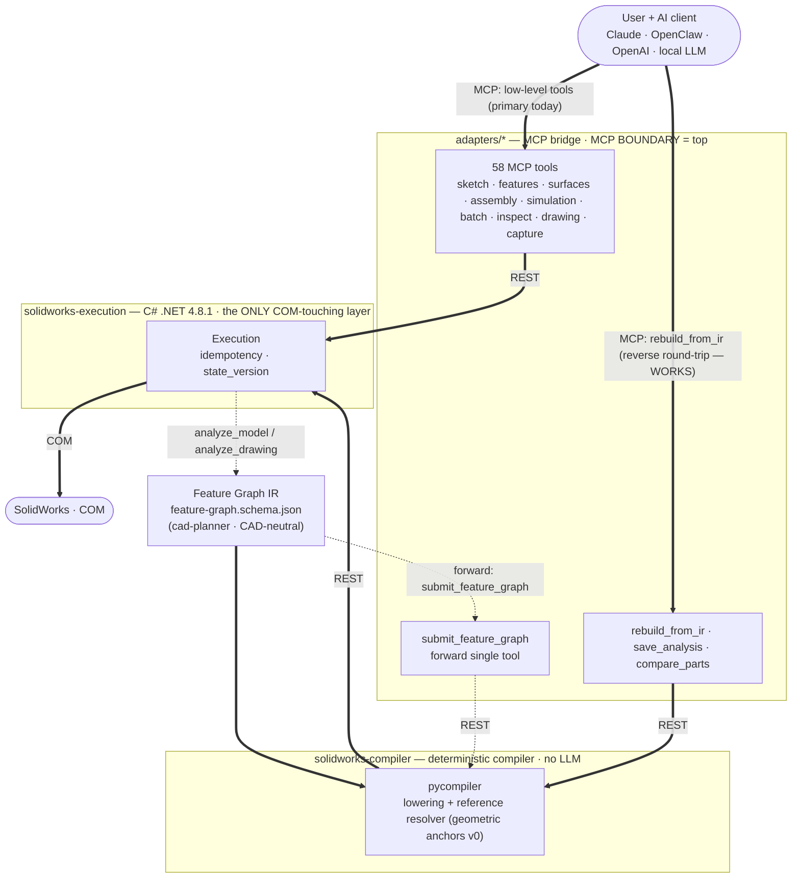

# Q3DS SolidWorks MCP

**An independently maintained fork of SolidPilot.**

> **Fork notice:** This repository is an independently maintained AGPL-3.0 fork of
> [`eyfel/mcp-server-solidworks`](https://github.com/eyfel/mcp-server-solidworks), based on upstream
> commit [`a7348f0`](https://github.com/eyfel/mcp-server-solidworks/commit/a7348f0). Fork modifications
> have been maintained by **Benny Cohen** since **2026-07-11**. See [NOTICE.md](NOTICE.md) for complete
> attribution.

This project is not affiliated with, authorized by, or endorsed by Dassault Systèmes or SOLIDWORKS.
SOLIDWORKS and related marks belong to their respective owners.

**AI-driven CAD automation for SolidWorks — an MCP (Model Context Protocol) server.**

SolidPilot lets an AI model work with SolidWorks at the **CAD feature level**. The goal is for the model to reason in terms of "which CAD intent am I realizing?" instead of "which API method should I call?". Intent is converted into a CAD-neutral intermediate representation, and a deterministic compiler lowers that representation into concrete SolidWorks operations.

SolidPilot is **not** a Claude-only plugin; it is **a general bridge between SolidWorks and AI.** Because MCP is an open standard, any MCP-capable AI client can connect — alongside Claude, OpenClaw, OpenAI-based agents, and local LLMs are also targeted. The architecture was designed for this extensibility **from the start**: the execution and planner layers do not know which client is calling them; a thin adapter per client reuses a shared bridge core. `adapters/claude/` is the current implementation; supporting a new AI client means only adding a new adapter.

> Upstream repository: `eyfel/mcp-server-solidworks` · Public name: **SolidPilot** · Target version: **SolidWorks 2026**

## Fork additions

The fork currently exposes **58 MCP tools**. Its improvement passes add native sketch text,
single- and multi-view model screenshots, compact JSON responses, batched execution, compact
model inspection, revolved cuts, persistent HTTP connections, multi-region boss recovery, higher
volume precision, clearer diagnostics, a first native assembly slice (insert components,
coincident/concentric/distance mates via persistent face references, read-only assembly
analysis), and a reference-modeling workflow (load/crop design photos, reference-vs-model
comparison montages, an on-demand photo-to-part protocol). Eight SolidWorks Simulation tools add
static/topology study creation, fixtures, forces, meshing/solving, result extraction, topology
controls, study listing, and deletion. `knit_surfaces` joins surface bodies into one knit feature
(optionally forming a solid, with honest solid/open reporting). See [CHANGELOG.md](CHANGELOG.md)
for release history.

---

## Core Idea

The SolidWorks API exposes thousands of methods. Presenting each one to the AI as a separate "tool" explodes context size and token cost — the economic problem that stalls similar projects.

SolidPilot solves this by **raising the level of abstraction**:

- The AI produces intent at the **feature level** (for example, "put a hole in the top face").
- That intent is expressed as a CAD-neutral **Feature Graph IR**.
- A deterministic **compiler** lowers the IR into ordered, concrete SolidWorks operations.
- A single feature therefore maps to many low-level operations, and one model call per request is enough.

---

## Architecture



Read the diagram by line style: a **thick line works today**, a **dashed line is planned**. Two MCP doors are live — the 58-tool MCP surface (the primary path today), and **`rebuild_from_ir`**, which drives the **real** deterministic compiler to reproduce a part from its Feature Graph IR. The dotted reverse arrow is the discovery step: `analyze_model`/`analyze_drawing` read an existing part so an IR can be proposed for it. The only dashed (still-planned) piece is the *forward* collapse — a single `submit_feature_graph` tool that would replace the low-level surface for building from scratch; it runs through the same compiler.

The system has four layers:

| Layer | Directory | Language | Responsibility |
|---|---|---|---|
| Planner / Intent | `cad-planner/` | AI model + IR schema | Turns user intent into a CAD-neutral Feature Graph IR. Never touches COM, never emits raw tool calls. |
| Compiler | `solidworks-compiler/` | Deterministic (no LLM) | Lowers the IR into ordered tool calls; resolves semantic references (e.g. `top_face`, `center`) against live geometry state. |
| Execution | `solidworks-execution/` | C# (.NET Framework 4.8.1) | The **only** layer that touches the SolidWorks COM API. The single source of truth for CAD state. |
| Adapter | `adapters/claude/` | Python (FastMCP) | MCP protocol bridge. The MCP boundary sits at the **top** of the system. |

**MCP sits at the top:** it is the boundary where the AI client meets the system, not an internal transport. Everything below the IR is deterministic and communicates over plain REST.

The `adapters/` layer is provider-specific and replaceable. Because the execution and planner layers do not know which client is calling, adding a new AI client (OpenClaw, OpenAI, a local LLM, etc.) means only writing a new adapter — the IR, compiler, and execution layers stay unchanged.

**Current vs. target:** the Feature Graph IR and the deterministic compiler now **exist and work** — the compiler (`solidworks-compiler/pycompiler`, lowering + a v0 reference resolver) has reproduced **real production parts** end-to-end from their IR to a `verified` match (see Project Status). It is reached today through the **`rebuild_from_ir`** tool (the reverse/reproduce direction). What is still ahead is the *forward* collapse: replacing the low-level surface with a single `submit_feature_graph` tool for building from scratch, and a **durable reference resolver** that survives edits (the make-or-break module). Until then the low-level MCP tools remain the primary path for building.

---

## Tool List

The system currently exposes **43 tools**; a contract test keeps the adapter and execution contract in exact sync (see [CONTRIBUTING.md](CONTRIBUTING.md)). Low-level operations remain available, while `execute_batch` and `inspect_model` reduce round trips for normal agent workflows. All lengths are in meters (SolidWorks internal units).

### Document and lifecycle
- `ensure_ready` — launches SolidWorks via COM and attaches if it is closed (does not open a document).
- `open_new_part` — opens a new part document.
- `open_document` — opens an existing file from disk (native `.sldprt`/`.sldasm`/`.slddrw`; imports `.ipt`/`.CATPart`/STEP/IGES via 3D Interconnect when the translator is available, otherwise returns a clear `OPEN_FAILED`).
- `activate_document` — switches between open documents.
- `save_document` — saves the part or drawing to disk.
- `close_document` — closes the document.

### Sketch
- `create_sketch` — starts a sketch on a plane or a selected face.
- `edit_sketch` — reopens an existing sketch for editing.
- `add_sketch_entity` — adds a sketch entity: line, circle, arc, center arc, ellipse, spline, rectangle, fillet, chamfer.
- `add_sketch_text` — adds TrueType sketch text with anchor, height, rotation, bold/italic, and font controls. The resulting contours can be raised with a boss or engraved with a cut. For text on a model surface, use a reference plane at the surface height; a face sketch may also capture and extrude the face outline.
- `add_sketch_constraint` — adds a sketch relation (horizontal, coincident, etc.).
- `add_dimension` — adds a dimension to the sketch.

### Feature and solid modeling
- `extrude_feature` — boss, cut, revolve, **revolve_cut**, sweep, loft.
- `add_edge_feature` — fillet or chamfer on a solid edge (chamfer: distance-angle at any angle, or distance-distance).
- `create_rib` — rib feature from an open sketch profile.
- `add_reference_geometry` — reference plane, axis, or point.
- `create_pattern` — linear or circular pattern.
- `sheet_metal_feature` — sheet metal: base_flange, edge_flange (incl. custom-profile flanges), sketched_bend, flat_pattern.

### Editing
- `modify_dimension` — changes the value of a named dimension (the basis for variants).
- `edit_feature` — suppresses, unsuppresses, deletes, or renames a feature.

### Material
- `set_part_material` — assigns a material to the part.

### Analysis and query
- `analyze_model` — `geometry`, `mass_properties`, `features` (a compact feature-level recipe), `edges`, `faces`, `sketch` (one sketch's exact segments on demand), and `feature_map` (per-feature consumed/created topology — the source of the reference-resolver anchors) modes.
- `capture_view` — orients the active model to a named view, zooms to fit, and returns a PNG directly as MCP image content; an optional path also saves the image to disk.
- `capture_view_set` — returns one labelled PNG montage containing up to four synchronized named views.
- `inspect_model` — returns compact topology, mass, optional feature summary, and an optional multi-view montage in one call.
- `get_selection` — reads the geometry the user selected in the SolidWorks GUI and maps it to the analyze index.
- `verify_state` — returns the current state and feature tree.

### Agent efficiency
- `execute_batch` — runs up to 100 ordered low-level operations in one MCP call; exact references such as `$last.features.0` reuse earlier results.
- `search_solidworks_references` — searches locally indexed SolidWorks books and returns short, page-cited passages. Source PDFs and extracted page indexes remain local under `.solidpilot/` and are not committed.

### Local book references

Put machine-specific PDF paths in `.solidpilot/references.json`, then build the ignored page index:

```powershell
python scripts/build_reference_index.py
```

The indexer requires `pypdf`. It stores page text in `.solidpilot/reference-index/`; the MCP search tool returns compact snippets with the book title, PDF page number, and original local path. Rebuild the index after replacing a PDF.
- `solidworks_help` — returns detailed workflow guidance only when requested, keeping the always-loaded tool schema substantially smaller.

### Analysis pipeline & IR round-trip
These tools implement the reverse-engineering loop — *"the LLM proposes, the round-trip decides"* — that reproduces an existing part from a CAD-neutral Feature Graph IR and objectively verifies the result.

- `save_analysis` — writes an **analysis artifact** for the active part (feature recipe, driving parameters, and an optional Feature Graph IR block) to `<folder>/.solidpilot/`.
- `rebuild_from_ir` — the mainline IR door: runs an artifact's IR block through the deterministic compiler to rebuild the part in a fresh document (same compiler that the future `submit_feature_graph` will use — two doors, one compiler).
- `compare_parts` — objective two-part diff (topology, volume, area, center of mass) with the project's `verified` verdict (topology-exact **and** |ΔV| ≤ 1% **and** |ΔA| ≤ 1%).

### Drawing
The drawing tools were added after the initial part-modeling set and are now a substantial — though still maturing — capability. They are enough to take a model to a dimensioned multi-view drawing, and to read a drawing back for reverse-engineering.

- `create_drawing` — creates a drawing document (A3 sheet).
- `add_drawing_view` — adds a model view: `front`, `top`, `right`, `isometric`, `back`, `bottom`, `left`.
- `add_flat_pattern_view` — adds a sheet-metal **flat-pattern** view (the unfolded blank with bend lines and bend notes); the correct, standard way to detail sheet-metal parts.
- `auto_dimension_drawing` — transfers the model's driving dimensions into the views (the "Insert Model Items" automation) — the robust alternative to placing dimensions by coordinate.
- `auto_center_marks` — automatically inserts center marks and centerlines on every hole/slot.
- `add_hole_callout` — adds a hole callout on a hole edge.
- `add_drawing_dimension` — adds a single dimension by sheet coordinate.
- `add_section_view` — section view (**experimental**; the API path works on a clean drawing state but is not yet reliable under automation — see Project Status).
- `analyze_drawing` — reads the active drawing structurally: per-view name/type/scale/position and its dimensions; with `include_geometry`, it also returns each view's **projected 2D geometry as clean primitives** (lines and curves), which is the clean shape used to reverse-engineer a part from its drawing independently of dimension-line clutter.

### Export
- `export_document` — STEP, IGES, STL, **PDF, DWG, DXF** (PDF/DWG/DXF require a drawing document).
- `batch_export` — batch export.

---

## Fast screenshot-driven workflow

For a part described by photographs or screenshots:

1. Extract explicit dimensions, symmetry, repeated-feature counts, datums, and silhouettes. If no
   scale is visible, state a concept scale instead of implying an exact copy.
2. Build the master body and primary datums first. Use `execute_batch` for dense sketch/entity
   sequences that do not require visual judgment between calls.
3. After each major feature, call `inspect_model`. Its compact topology/mass summary and labelled
   top/isometric/right/front montage make planform, height, taper, and junction errors visible at once.
4. Correct the modelling cause, then inspect again. Finish by checking body count, open holes,
   pattern instances, feature names, and mass properties.

Detailed instructions stay out of the always-loaded schema and are available through
`solidworks_help(topic="visual_assignment")` or the other help topics.

Example batch payload:

```json
{
  "operations": [
    {"tool": "create_sketch", "params": {"plane": "Top Plane"}},
    {"tool": "add_sketch_entity", "params": {
      "entity_type": "rectangle", "x1": 0, "y1": 0, "x2": 0.04, "y2": 0.02
    }},
    {"tool": "extrude_feature", "params": {"feature_type": "boss", "depth": 0.01}}
  ]
}
```

---

## Installation and Running

### Requirements

- Windows and **SolidWorks 2026**.
- **.NET Framework 4.8.1 Developer Pack** and MSBuild for the execution layer (available with Visual Studio 2022).
- **Python 3.12** for the hash-pinned Windows dependency lock and CI parity.
- An MCP client that can launch a local stdio server, such as Claude Desktop or Codex.

Run the following commands from the repository root in PowerShell. The examples below assume the
repository is at `C:\src\solidpilot`; replace that path with the absolute path to your clone.

### Python environment

```powershell
py -3.12 -m venv .venv
& .\.venv\Scripts\python.exe -m pip install --require-hashes -r requirements.lock
Copy-Item adapters\claude\.env.example adapters\claude\.env
```

The checked-in `.env.example` contains only local defaults. `adapters/claude/.env` is ignored by
Git and is loaded relative to `server.py`, regardless of the MCP client's working directory.
Contributors should install `requirements-dev.lock` instead; see [CONTRIBUTING.md](CONTRIBUTING.md).

### Execution layer (C#)

Build the solution:

```powershell
& "C:\Program Files\Microsoft Visual Studio\2022\Community\MSBuild\Current\Bin\MSBuild.exe" solidworks-execution\SolidworksExecution.sln /t:Build /p:Configuration=Debug
```

Adjust `Community` if a different Visual Studio edition is installed. The adapter automatically
starts the built execution server when `http://localhost:5000/health` is unavailable. To start it
yourself for troubleshooting:

```powershell
Start-Process .\solidworks-execution\SolidworksExecution\bin\Debug\SolidworksExecution.exe -WindowStyle Hidden
```

### Adapter (Python)

Run the stdio adapter directly for a smoke test:

```powershell
& .\.venv\Scripts\python.exe .\adapters\claude\server.py
```

The adapter connects to the execution layer at `EXECUTION_BASE_URL` (default
`http://localhost:5000`). See [adapters/claude/.env.example](adapters/claude/.env.example) for all
supported local settings.

### Claude Desktop registration

Open this file:

```text
C:\Users\<username>\AppData\Roaming\Claude\claude_desktop_config.json
```

Use a complete configuration object like this, updating both absolute paths:

```json
{
  "mcpServers": {
    "solidpilot": {
      "command": "C:\\src\\solidpilot\\.venv\\Scripts\\python.exe",
      "args": [
        "C:\\src\\solidpilot\\adapters\\claude\\server.py"
      ],
      "env": {
        "EXECUTION_BASE_URL": "http://localhost:5000"
      }
    }
  }
}
```

Restart Claude Desktop after saving the file.

### Codex registration

Codex can register the stdio server from PowerShell:

```powershell
codex mcp add solidpilot -- "C:\src\solidpilot\.venv\Scripts\python.exe" "C:\src\solidpilot\adapters\claude\server.py"
codex mcp get solidpilot
```

Alternatively, add the following to `$HOME\.codex\config.toml`:

```toml
[mcp_servers.solidpilot]
command = 'C:\src\solidpilot\.venv\Scripts\python.exe'
args = ['C:\src\solidpilot\adapters\claude\server.py']

[mcp_servers.solidpilot.env]
EXECUTION_BASE_URL = 'http://localhost:5000'
```

Start a new Codex task after changing MCP configuration so the 43-tool surface is discovered.

### Other MCP clients

Configure a **stdio** MCP server with these fields in the format your client expects:

```text
name: solidpilot
command: C:\src\solidpilot\.venv\Scripts\python.exe
args: [C:\src\solidpilot\adapters\claude\server.py]
environment: EXECUTION_BASE_URL=http://localhost:5000
```

The MCP transport is stdio between the client and `server.py`. The local HTTP endpoint is an
internal adapter-to-execution connection and should not be exposed to another machine. After any
`server.py` change, reconnect or restart the MCP client because the adapter does not hot-reload.

---

## Project Status

SolidPilot is a **working prototype / early alpha**. The low-level tools have been verified end-to-end against live SolidWorks; all COM calls are serialized on a single dedicated STA thread.

**Parts:** the part-modeling surface is the most mature — sketches, extrude/revolve/sweep/loft, fillets/chamfers, patterns, sheet metal, reference geometry, plus editing (`modify_dimension`, `edit_feature`) and rich analysis. Initially only the tools needed for part creation existed.

**Technical drawing:** added later and now a real (if still maturing) capability — multi-view drawings, model-item auto-dimensioning, center marks, hole callouts, sheet-metal flat-pattern views, and a structural drawing reader. The reverse direction (**drawing → model**) has been demonstrated: a part reconstructed from its drawing alone (read via `analyze_drawing(include_geometry)`) matched the original exactly in volume, surface area, and topology. Section views are experimental and not yet reliable under automation.

**Feature Graph IR + compiler (the strategic core):** now the project's spine and **working**. The IR schema (`cad-planner/contracts/feature-graph.schema.json`) and a deterministic Python compiler (`solidworks-compiler/pycompiler`, lowering + a **v0 reference resolver** built on geometric anchors) run every rebuild through one code path, with an offline test suite (no live SolidWorks needed). Via the reverse round-trip — `analyze_model` → an LLM-proposed IR → `rebuild_from_ir` → `compare_parts` — real production parts have been reproduced from their IR to a `verified` match, spanning revolves, circular patterns, both chamfer modes, lofts, and multi-bend sheet-metal forms. Each part is rebuilt in a fresh document and checked against the original by exact topology and mass properties before it counts as verified. Growing the IR vocabulary from real parts is how it advances.

The open problem — and the project's real research risk — is a **durable reference resolver**: the v0 geometric anchors reproduce a part exactly in a fresh document but do **not** survive upstream edits (a changed dimension moves the anchors). Making semantic references (`top_face`, a specific edge) robust across topology changes is the make-or-break module still ahead.

> **Two IR doors, one compiler.** The mainline door is `rebuild_from_ir` (reproduce from an artifact). A second, *forward* door — `submit_feature_graph`, building from scratch — is scaffolded but intentionally **commented out** in `adapters/claude/server.py` (it collapses the low-level surface into one tool, which is future work); re-enabling it is a one-block uncomment. Both doors execute through the same `pycompiler`, so every replay lesson improves both at once.

**Testing:** Windows CI installs `requirements-dev.lock` with hash verification, checks the 43-tool
adapter/execution contract, runs the offline compiler tests, and compiles the Python sources.
Behavioral verification against live SolidWorks remains manual by design.

Notes:
- The Python MCP adapter does not hot-reload while running; after editing `server.py`, the MCP server must be reconnected.

---

## Roadmap

The project is under active development. The Feature Graph IR and deterministic compiler now work for parts (verified end-to-end on real production parts); the main next goals:

- **Durable reference resolver / persistent naming** — the critical module: making semantic references (`top_face`, a specific edge) survive dimension and topology changes, not just fresh-document replay. The current v0 geometric anchors are exact but edit-fragile.
- **Assembly (V2)** — the next domain: `analyze_assembly` (read-first), an assembly IR sub-vocabulary (components + mates), component insertion and mating, and round-trip verification for assemblies.
- **Analysis pipeline breadth** — a folder scanner (batch-analyze a directory of parts/drawings into artifacts), an AI pass that generates IR per category with a coverage report, and pattern reuse across verified IRs (parametric rebuilds without an LLM).
- **Forward IR surface** — collapsing the low-level tools under the single `submit_feature_graph` interface once the vocabulary and resolver are ready.

Coming soon in existing areas:

- **Technical drawing:** the core tools exist; remaining work is reliable section views, GD&T / datums, title blocks, detail views, and a bill of materials (BOM).
- **Assembly drawings / BOM** and broader engineering-analysis support.

---

## Contributing

For development setup, contribution workflow, and the DCO sign-off requirement, see
[CONTRIBUTING.md](CONTRIBUTING.md) and [CLA.md](CLA.md). Security reports follow
[SECURITY.md](SECURITY.md).

---

## License

Copyright (c) 2025–2026 Çağatay Bakan.

Copyright (c) 2026 Benny Cohen for fork modifications beginning 2026-07-11.

SolidPilot is free software, licensed under the
[GNU Affero General Public License v3.0](LICENSE) (AGPL-3.0).

You may use, study, modify, and distribute it freely. Because SolidPilot is
server software, the AGPL's network clause (§13) applies: **if you run a
modified version and let others interact with it over a network, you must offer
those users the complete corresponding source of your modified version, under
the same license.** See the [LICENSE](LICENSE) for the exact terms.

This fork is offered under the AGPL-3.0 only. The fork maintainer does **not** claim authority to
offer a proprietary or commercial license for the combined upstream-and-fork work. Anyone seeking
different terms must obtain all necessary permissions from the relevant copyright holders. See
[NOTICE.md](NOTICE.md) for lineage, scope, and trademark notices.
